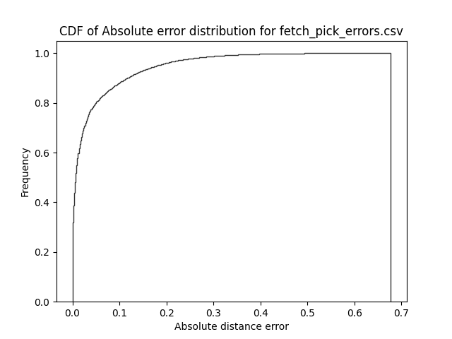
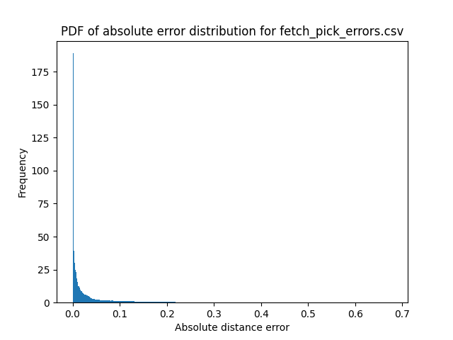
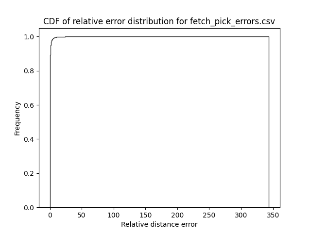
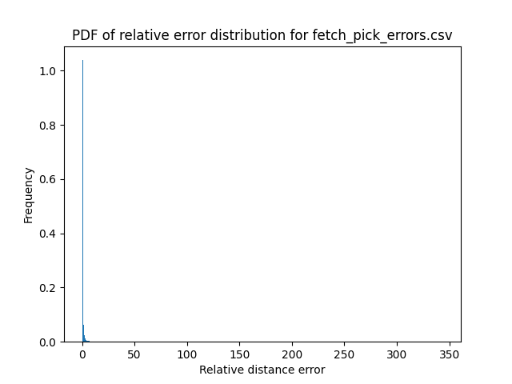
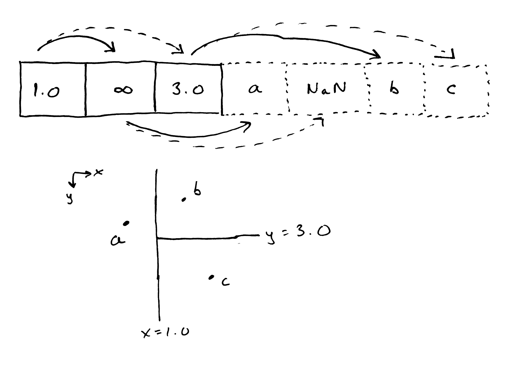

# SIMD-accelerated Approximate Nearest Neighbors

## Usage

To run the benchmark, do `cargo run --release --bin bench path/to/my_pointcloud.hd5`.
To generate a CSV file with error distribution information, run
`cargo run --release --bin error path/to/my_pointcloud.hd5 > errors.csv`.
To parse this CSV file and generate plots, run
`python ./pkdt_bench/scripts/plot_error_hist.py errors.csv`.

## TODO

- ~~Support non-power-of-2 trees.~~
- Develop $O(n \log n)$ algorithm for building the tree.
  - Use median of medians?
- ~~Get an error distribution of (approx neighbor distance / exact neighbor distance)~~
- Make crosswise table of parallel speedups by lane count and tree size
- Generalize benchmarking approach for arbitrary nearest-neighbors structures and test against the
  whole suite of bad implementations on [crates.io](crates.io)
- Build out an actual test suite that isn't just some numbers I made up
- ~~Move benchmarking binary into its own compilation unit so we don't have to pull in a bunch of
  dependencies when developing~~
- Determine whether it's more efficient to store each point in SoA style or AoS style
  - if we use AoS and do some clever pointer arithmetic on the last
- Develop probabilistic argument about error distribution (makes paper actually readable)
- Develop argument about appropriate sphere affordance to reduce likelihood of collision
- Extend this approach to $k$-nearest-neighbors?
- Handle points with the same values along one axis
- Support exact nearest neighbors

### The figures I'm looking for

- Heatmap with number of points as X axis, number of SIMD lanes as Y axis, and query time on Z axis.
- Violin plot of runtime across different nearest neighbors structures, with mine being the fastest.
- Violin plot of error distribution across different nearest neighbors structures, with mine being
  not the worst.
- Error distributions (approx neighbor distance / exact neighbor distance) as histograms.

  
  
  
  
- A nice TikZ or SVG picture showing the data layout and traversal scheme.

  

## Ideas for error management

- **Early bail**. Avoid doing the last few tests, then exhaustively check all children.
  Very easy to implement and probably performant, but not guaranteed.
- **Conservative backtracking**. Backtrack in parallel, quitting only when we have a proof for all
  lanes.
- **Bounded backtracking**. Backtrack in parallel but bail after a fixed number of backtracks.
  - Halt backtracking once we have an acceptable error bound?
- **Just use octomaps**.
  - Memory usage issues?
  - How do we get distance to nearest voxel? Via compiled SDF?
- **Cached upward pass nodes**. Compute the set of nodes which would be considered in an upward pass
  and then store them
  - **Dynamic caching**, in which nodes are added as they are considered. _Question_: how to sort
    the nodes?
