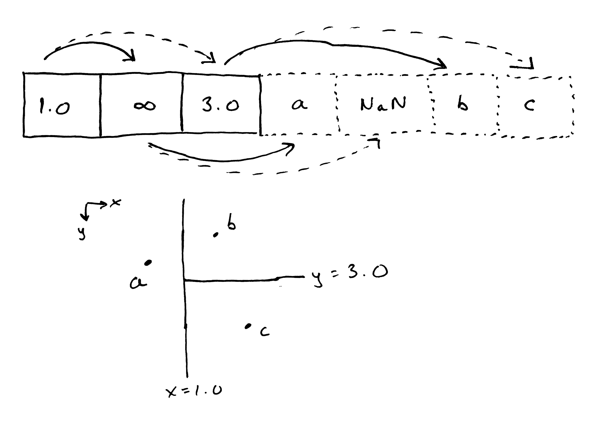

# SIMD-accelerated Approximate Nearest Neighbors

## Usage

To run the benchmark, do `cargo run --release`.

## TODO

- Support non-power-of-2 trees.
- Develop _O(n log n)_ algorithm for building the tree.
- Get an error distribution of (approx neighbor distance / exact neighbor distance)
- Make crosswise table of parallel speedups by lane count and tree size
- Generalize benchmarking approach for arbitrary nearest-neighbors structures and test against the
  whole suite of bad implementations on [crates.io](crates.io)
- Build out an actual test suite that isn't just some numbers I made up
- Move benchmarking binary into its own compilation unit so we don't have to pull in a bunch of
  dependencies when developing
- Determine whether it's more efficient to store each point in SoA style or AoS style
  - if we use AoS and do some clever pointer arithmetic on the last
- Develop probabilistic argument about error distribution (makes paper actually readable)
- Develop argument about appropriate sphere affordance to reduce likelihood of collision

### The figures I'm looking for

- Heatmap with number of points as X axis, number of SIMD lanes as Y axis, and query time on Z axis.
- Violin plot of runtime across different nearest neighbors structures, with mine being the fastest.
- Violin plot of error distribution across different nearest neighbors structures, with mine being
  not the worst.
- Error distributions (approx neighbor distance / exact neighbor distance) as histograms.
- A nice TikZ or SVG picture showing the data layout and traversal scheme.
  
